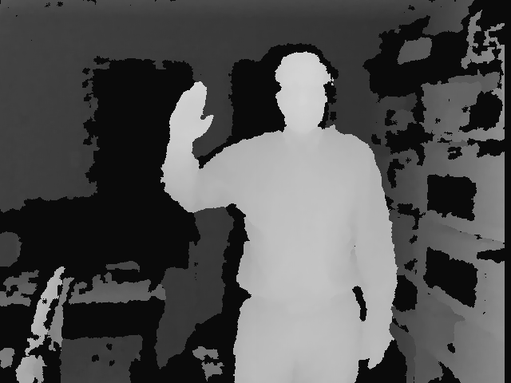
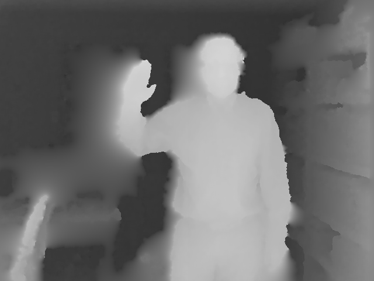

# Pothole Filler

Fills in gaps in RGBD images. The Kinect is a wonderful piece of hardware, but unfortunately the depth images it produces are filled with holes. This utility is a very crude attempt to fill those holes and produce more continuous depth images.

# Example
Here's a Kinect depth image before Pothole Filler, courtesy of [Norris Labs](http://www.norrislabs.com/).

And here it is after processing. 

As you can see, it's not perfect, but at least it's continuous.

# Usage

    npm install -g pothole-filler
    pothole-filler input.png -o output.png
    
If no output file is specified, the input file will be overwritten. Use `-h` to see a few more options.
    
# Input
By default, Pothole Filler assumes that inputs images are RGBA images with alpha channel mapped to an 8-bit version of the kinect's depth image. For grayscale images ( like the example above ), use the `-gray` command line argument.

Note that any anti-aliasing in the input image will cause substandard results. It you are scaling the depth image, as might be necessary to align the Kinect's colour and depth images, be sure to use nearest neighbour interpolation.

# Implementation
Pothole Filler works by identifying contiguous regions where depth information is less than a threshold, implying that the information is missing. Each pixel in the region is substituted with a weighed average of all pixels surrounding the region. Certainly not a fast algorithm, but it works.

# Name

Pothole Filler is named after a [particularly tasty beer](http://www.howesound.com/Brewery/Beers/Beer_PotholeFiller.aspx), brewed by the amazing [Howe Sound Brewery](http://www.howesound.com/).

